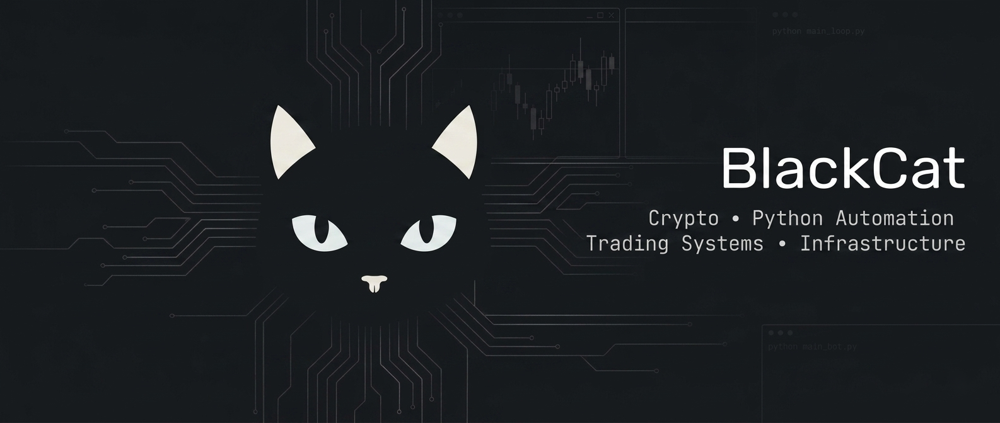

  

  

---

## 🐈‍⬛ About me

I've been around crypto since 2018.

I started with testnets, validators and blockchain nodes. That got me into Linux, servers, monitoring and infrastructure. Later I moved deeper into Python, automation and exchange APIs.

These days I mostly build things around **crypto markets, trading workflows and market data**.

A lot of my projects start from the same thought: "I'm tired of checking or doing this manually. Can I automate it?"

Sometimes the result is a small script. Sometimes it turns into a service that runs 24/7.

I care a lot about the boring parts too: logs, monitoring, recovery, testing, risk controls and making sure things keep working when nobody is watching them.

---

## 🚀 Featured project

### 📈 [Bybit Telegram Trading Bot](https://github.com/blackcat-team/Bybit_Trading_bot)

A Python trading bot for **Bybit Linear USDT** controlled through Telegram.

It started as a tool for my own trading workflow and kept growing as I added the things I actually needed.

Some of the features:

* fixed risk per trade
* automatic position sizing
* Stop Loss management
* multi-level Take Profit logic
* breakeven handling
* trading signal parsing
* Telegram controls
* position and order monitoring
* PnL reports
* Linux deployment with `systemd`

---

## 🔬 What I'm working on

Most of my current work sits somewhere between crypto markets and automation.

Things I'm interested in right now:

* 📊 exchange market data
* 💸 funding rates and cross-exchange spreads
* 🔔 listing and market event monitoring
* 🔌 exchange API integrations
* 🤖 Telegram bots and notifications
* 🛡️ trading risk management
* 🗄️ collecting data for later research
* 🖥️ long-running Python services

I especially like turning data from several exchanges and sources into something that can be monitored, compared and acted on automatically.

---

## 🛠️ Tools I use

  

---

## 🖥️ Infrastructure

I spent several years running blockchain nodes and validators, so infrastructure was a big part of how I learned the technical side of crypto.

My experience includes:

* Linux and Ubuntu server administration
* Docker
* systemd services and timers
* Python services
* PostgreSQL and SQLite
* Grafana and Prometheus
* Telegram monitoring and alerts
* server migrations and upgrades
* troubleshooting long-running services
* unattended workloads

I don't run the old testnet server fleet anymore.

Today most of my infrastructure work is about keeping my own bots, monitors, data collectors and other crypto tools running reliably.

---

<b>⛓️ Validator and testnet history</b>

 

Nodes and testnets were a big part of my crypto journey.

Over the years I've worked with networks and projects including:

`Aptos` • `Celestia` • `Sui` • `Starknet` • `Taiko` • `Massa`

`Archway` • `Exorde` • `Gitopia` • `Penumbra` • `Umee` • `Nibiru`

`Empower` • `Nolus` • `Minima` • `Shardeum` • `Cysic` • `Ritual`

`Waku` • `Rivalz` • `Chainflip` • `Subspace` • `BASE` • `Humans`

That work included:

* node installation and maintenance
* validator operation
* network upgrades
* monitoring
* troubleshooting
* testnet participation

I keep this section here because it is where a lot of my infrastructure experience started, even though nodes are no longer my main focus.

---

## 📊 GitHub

 

---

## 🤝 Contact

Telegram is usually the easiest way to reach me.

